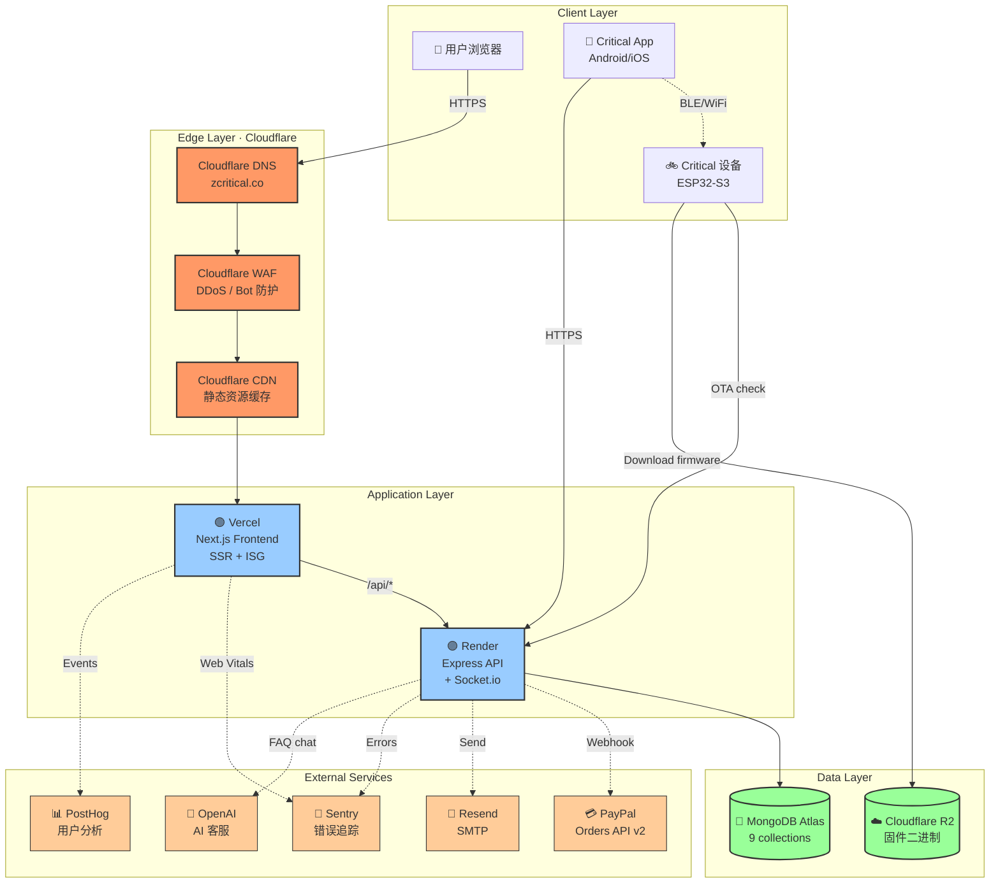
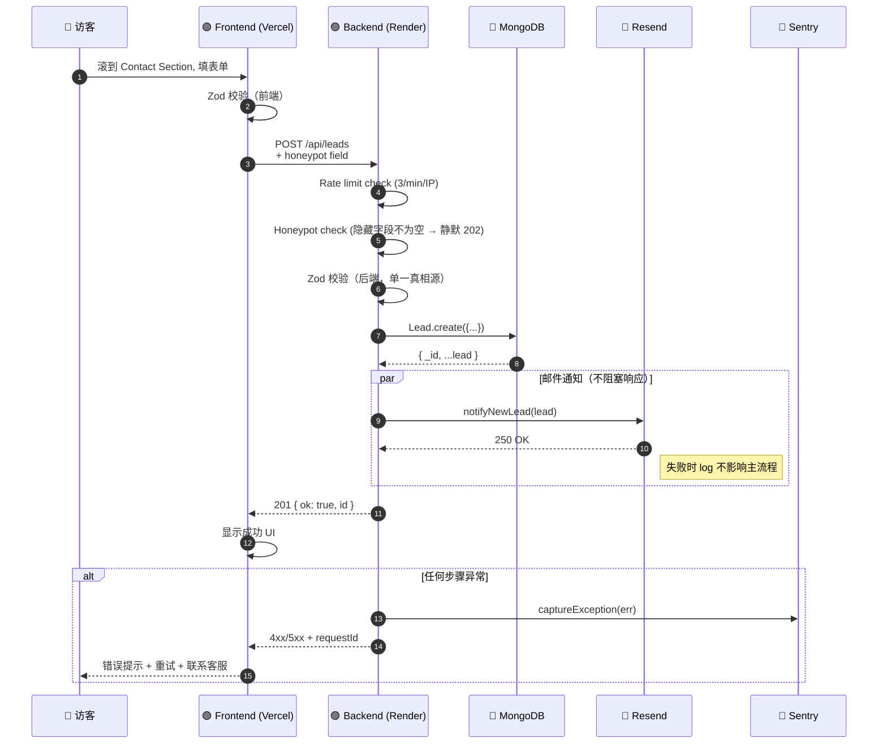
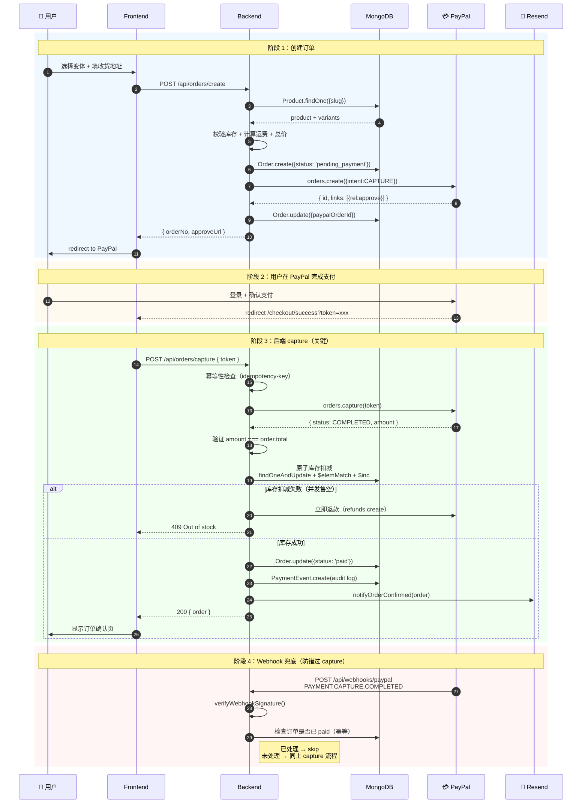
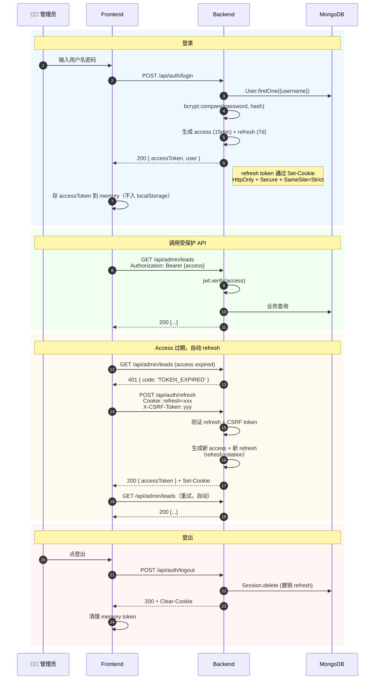
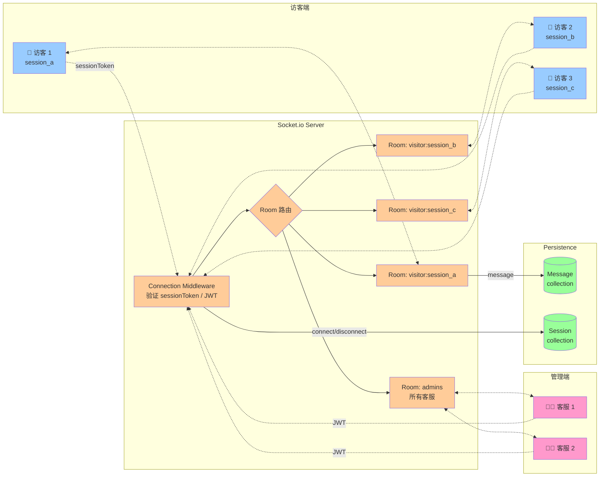
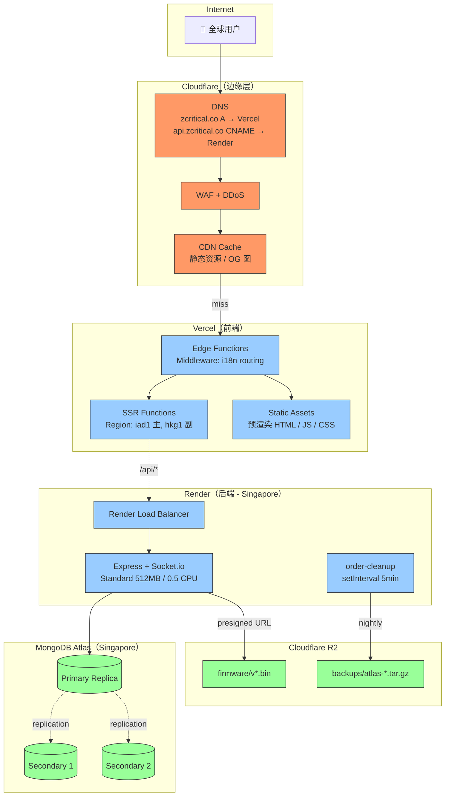
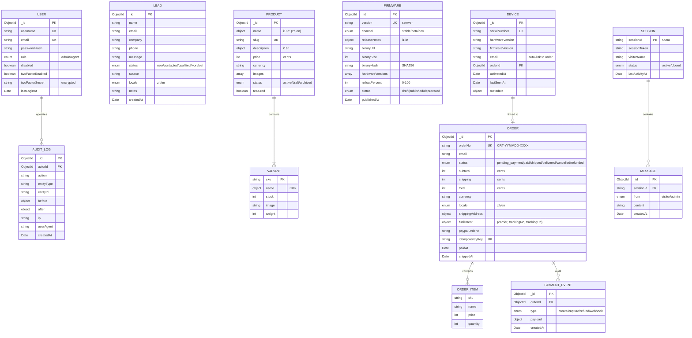

# Critical 系统架构可视化

> 8 张 Mermaid 图覆盖项目所有关键面。GitHub / VSCode / Mermaid Live Editor 都能直接渲染。

---

## 图 1：系统拓扑全景（Bird's Eye View）

**关键洞察**：

- 用户请求**永远先走 Cloudflare**（DNS + WAF + CDN）
- Vercel 处理静态/SSR，所有动态业务逻辑都打到 Render
- 设备直连 R2 下载固件（不经过后端，省带宽）
- 所有外部服务都是**异步 fire-and-forget**，不阻塞主流程

---

## 图 2：数据流 - Lead 询盘提交

**关键设计**：

- **双重校验**（前端 + 后端，用 shared schema 防漂移）
- **Honeypot** 静默返回 202，让爬虫以为成功了
- **Rate limit** 在后端做，而不是依赖前端 throttle
- **邮件 fire-and-forget**，绝不阻塞用户响应
- **所有异常**都带 requestId 方便客服查日志

---

## 图 3：数据流 - 订单全流程（Critical Path）

**关键设计**：

- **幂等性键** 防止重复 capture（用户刷新页面）
- **金额验证** 防止前端篡改价格
- **原子库存扣减** 用 `findOneAndUpdate` 单语句完成
- **库存失败立即退款** 防止用户付钱拿不到货
- **Webhook 兜底** 防止网络问题导致 capture 错过

---

## 图 4：认证授权时序（JWT 双 Token）

**安全设计**：

- **Access token 在内存**（不进 localStorage 防 XSS）
- **Refresh token 在 HttpOnly cookie**（JS 读不到）
- **CSRF 双提交** 保护 refresh / 任何 mutation
- **Refresh rotation** 每次 refresh 都换新的，旧的失效
- **Session 表** 让管理员能强制登出某用户

---

## 图 5：实时客服 Socket.io 架构

**关键设计**：

- **房间隔离**：每个访客独立房间，访客之间互不可见
- **管理员公共房**：所有客服在 `admins` 房间，任何访客新消息广播到所有客服
- **持久化**：消息写库，断网重连能拉历史
- **重连指数退避**：失败重连 1s → 2s → 4s → ... 上限 30s

---

## 图 6：部署拓扑（Production）

**关键设计**：

- **多 region**（Vercel iad1 + hkg1，Render Singapore）适合中美双向用户
- **Atlas 3 副本**自动故障转移
- **Cron 单实例**避免多实例 race condition
- **R2 用 presigned URL** 让设备直连下载，不走后端

---

## 图 7：数据模型 ER 图

**关键设计**：

- **i18n 字段** 用嵌套对象 `{zh, en}`（不是单语言）
- **金额都用 cents**（避免浮点误差）
- **审计字段**全表都有 `createdAt`，关键操作有 `AuditLog`
- **唯一索引** 在 `slug` / `sku` / `orderNo` / `serialNumber` / `version` / `idempotencyKey`

---

## 图 8：网络与安全分层

```mermaid
graph TB
  subgraph "Layer 0: 用户"
    U[👤 用户浏览器]
  end

  subgraph "Layer 1: 边缘防护"
    direction LR
    L1A[DDoS 缓解<br/>Cloudflare 自动]
    L1B[Bot 识别<br/>Cloudflare Bot Fight]
    L1C[WAF 规则<br/>OWASP Top 10]
    L1D[国家级封禁<br/>可选]
  end

  subgraph "Layer 2: HTTPS / TLS"
    direction LR
    L2A[TLS 1.3<br/>HSTS preload]
    L2B[CAA 限制 CA<br/>仅 Cloudflare Issue]
  end

  subgraph "Layer 3: 应用层防护"
    direction LR
    L3A[CSP nonce<br/>无 unsafe-inline]
    L3B[X-Frame-Options DENY<br/>Permissions-Policy]
    L3C[Referrer-Policy<br/>strict-origin]
    L3D[CORS 白名单]
  end

  subgraph "Layer 4: 认证 / 授权"
    direction LR
    L4A[JWT 双 Token]
    L4B[CSRF 双提交]
    L4C[Admin 2FA TOTP]
    L4D[速率限制]
  end

  subgraph "Layer 5: 输入验证"
    direction LR
    L5A[Zod schema<br/>统一校验]
    L5B[Mongoose 类型]
    L5C[Helmet 默认头]
    L5D[Honeypot 防机器人]
  end

  subgraph "Layer 6: 数据保护"
    direction LR
    L6A[bcrypt cost 12]
    L6B[Mongoose 字段加密<br/>PII 列加密]
    L6C[Atlas at-rest encryption]
    L6D[备份加密 + 异地]
  end

  subgraph "Layer 7: 可观测 / 审计"
    direction LR
    L7A[AuditLog 所有写]
    L7B[Pino 日志 redact]
    L7C[Sentry 错误]
    L7D[PostHog 行为]
  end

  subgraph "Layer 8: 供应链 / 合规"
    direction LR
    L8A[CodeQL 周扫]
    L8B[Semgrep PR 扫]
    L8C[Dependabot]
    L8D[SBOM Syft]
    L8E[GDPR 数据导出]
  end

  U --> L1A
  L1A --> L1B
  L1B --> L1C
  L1C --> L1D
  L1D --> L2A
  L2A --> L2B
  L2B --> L3A
  L3A --> L3B
  L3B --> L3C
  L3C --> L3D
  L3D --> L4A
  L4A --> L4B
  L4B --> L4C
  L4C --> L4D
  L4D --> L5A
  L5A --> L5B
  L5B --> L5C
  L5C --> L5D
  L5D --> L6A
  L6A --> L6B
  L6B --> L6C
  L6C --> L6D
  L6D --> L7A
  L7A --> L7B
  L7B --> L7C
  L7C --> L7D
  L7D --> L8A
  L8A --> L8B
  L8B --> L8C
  L8C --> L8D
  L8D --> L8E

  classDef l1 fill:#f99
  classDef l2 fill:#fc9
  classDef l3 fill:#ff9
  classDef l4 fill:#9f9
  classDef l5 fill:#9fc
  classDef l6 fill:#9cf
  classDef l7 fill:#c9f
  classDef l8 fill:#f9c

  class L1A,L1B,L1C,L1D l1
  class L2A,L2B l2
  class L3A,L3B,L3C,L3D l3
  class L4A,L4B,L4C,L4D l4
  class L5A,L5B,L5C,L5D l5
  class L6A,L6B,L6C,L6D l6
  class L7A,L7B,L7C,L7D l7
  class L8A,L8B,L8C,L8D,L8E l8
```

**关键设计**：

- **8 层纵深防御** — 任何一层失守，下一层兜底
- **零信任原则** — 每层都重新验证，不假设上一层做过
- **当前状态**：
  - ✅ Layer 1-2 已配（Cloudflare）
  - ✅ Layer 3-5 大部分已配
  - 🟡 Layer 6 部分（bcrypt 已配，PII 加密 W2 做）
  - ✅ Layer 7 已配
  - 🟡 Layer 8 部分（CodeQL 已配，其他 W2 做）

---

## 如何使用这些图

### 给开发者

- 上手前先看图 1 + 图 7，30 分钟理解全貌
- 改动支付相关代码前必看图 3
- 改动认证相关代码前必看图 4

### 给安全审计

- 图 8 是审计的入口
- 任何防护层缺失立刻定位

### 给运维

- 图 6 是部署故障排查的总图
- 配合 `docs/DEPLOY.md` Runbook

### 给产品 / 客户

- 图 1 简化版可作 pitch deck 一页 slide
- 图 3 可作"你的钱怎么处理"信任建立材料

---

## 维护原则

- **任何新模块进入系统**，必须先在对应图加节点
- **任何流程变更**，时序图必须同步更新
- **每个 Phase 末**，PR 必须勾选"架构图已更新"
- 图位置：本文件 + `docs/diagrams/*.mmd`（独立文件方便单独 review）

---

> 一图胜千言。但一张乱图能毁掉千言。
> 这些图必须保持简洁、准确、当前。
