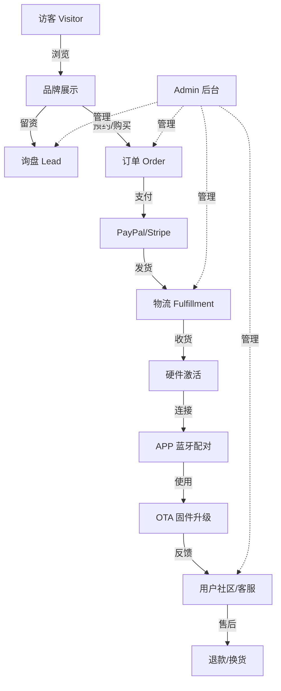
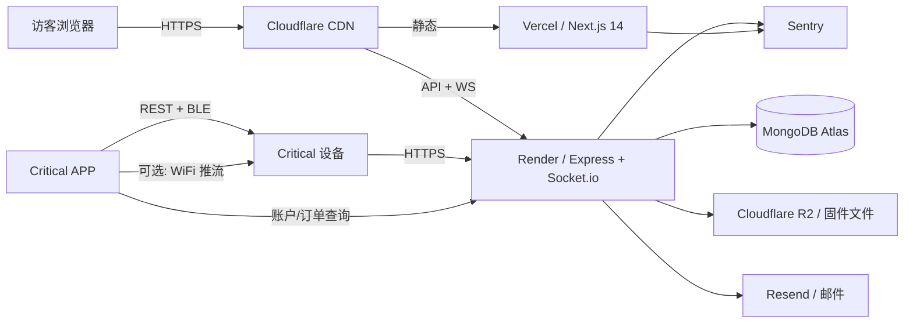

# Critical 闭环架构设计

> 版本: v0.1 · 日期: 2026-05-26 · 状态: 提案
>
> 本文档定义 Critical 智能风洞模拟器从"品牌展示站"演进到"完整商业闭环"的技术架构。
> 参考 ModelZone (mojing) 项目的成熟模型，结合 Critical 自身业务特性调整。

---

## 1. 业务闭环模型

Critical 不是单纯的电商，是"硬件 + APP + 固件"三位一体的产品系统。完整闭环：



### 1.1 与 mojing 的差异

| 维度     | mojing                 | Critical                |
| -------- | ---------------------- | ----------------------- |
| 主营产品 | 单一硬件 (Wind Chaser) | 硬件 + APP + 固件三件套 |
| 客单价   | $299 (低)              | 待定（预计中高）        |
| 复购率   | 低                     | 极低                    |
| 用户身份 | 游客下单               | 游客下单 + 设备绑定     |
| 售后特性 | 退换货                 | 退换货 + OTA + APP 支持 |
| 内容运营 | Blog 案例              | Blog + 教程 + 用户作品  |
| 实时交互 | Socket.io 客服         | 客服 + 设备状态推送(V2) |

### 1.2 Critical 闭环的特殊性

1. **设备绑定**：硬件激活时通过 APP 上报序列号，后台关联订单 → 用户 → 设备
2. **固件分发**：OTA 升级通道是产品命脉，需要版本管理 + 分组发布 + 回滚
3. **APP 推流**：当前 v1.0.0 已有，需要后端配合（设备认证、推送通知）
4. **用户作品**：内容运营天然依赖用户产出（骑行视频、自定义灯效），需要 UGC 闭环

---

## 2. 系统架构总图



### 2.1 运行时边界

- **Frontend (Vercel Hobby)** — Next.js 14 App Router
  - 静态营销页 (`/`, `/firmware`, `/support`, `/download`, `/blog`)
  - 客户端组件 (`/admin`, `/checkout`, `/account`)
  - 与后端通信：REST + Socket.io
  - 错误监控：`@sentry/nextjs`

- **Backend (Render free tier `singapore`)** — Node 20 + Express + Socket.io
  - REST API (`/api/leads`, `/api/orders`, `/api/firmware`, `/api/devices`)
  - WebSocket 长连接 (客服聊天，未来：设备状态推送)
  - 单实例部署，Socket.io Redis adapter 推迟到 V3
  - 错误监控：`@sentry/node`

- **Shared (`@critical/shared`)** — 单一真相源
  - Zod schemas (商品、订单、Lead、设备、固件)
  - TypeScript 类型导出
  - Socket.io 事件常量
  - 业务常量 (订单状态、设备状态、固件渠道)

- **Storage (Cloudflare R2)** — 固件二进制文件
  - 免费 10GB，符合 S3 API
  - 通过 API 签名 URL 下载，可控制权限和限流

### 2.2 与 mojing 的复用度

| 模块                 | 复用 | 说明                                |
| -------------------- | ---- | ----------------------------------- |
| Auth (JWT 双 token)  | ✅   | 直接复用                            |
| Lead 模型 + 邮件     | ✅   | 询盘流程一致                        |
| Socket.io 客服       | ✅   | visitor + admin 房间模式            |
| Order + PaymentEvent | ✅   | 订单结构、状态机、PayPal 集成       |
| 库存原子扣减         | ✅   | findOneAndUpdate 模式               |
| Product 模型         | ⚠️   | 需扩展（绑定固件版本/APP 兼容性）   |
| Audit 日志           | ✅   | 操作审计模式相同                    |
| i18n + Sentry + CSP  | ✅   | 通用基础设施                        |
| —— 新增 ——           |      |                                     |
| Device 模型          | ❌   | Critical 新增（激活、序列号、绑定） |
| Firmware 模型        | ❌   | Critical 新增（版本/渠道/灰度）     |
| OTA 签名 URL         | ❌   | Critical 新增（防外链）             |

---

## 3. 数据模型核心

### 3.1 复用 mojing 的模型

照搬以下 schema：

- `User.model.ts` — Admin 用户
- `Lead.model.ts` — 询盘表单
- `Session.model.ts` / `Message.model.ts` — 客服会话/消息
- `AuditLog.model.ts` — 操作审计
- `Order.model.ts` / `PaymentEvent.model.ts` — 订单 + 支付日志
- `Product.model.ts` — 商品（扩展固件兼容性字段）

### 3.2 Critical 新增模型

#### Device.model.ts — 设备绑定

```typescript
{
  serialNumber: String,       // 设备序列号 (硬件烧录), unique
  email: String,              // 关联用户邮箱 (游客绑定)
  orderId: ObjectId?,         // 关联订单 (可选, 灰色市场设备无订单)
  hardwareVersion: String,    // PCB 版本, 如 "v1.0"
  firmwareVersion: String,    // 当前固件版本
  activatedAt: Date,          // 首次激活时间
  lastSeenAt: Date,           // 最近一次连接时间
  appVersion: String,         // APP 版本
  metadata: {
    region: String,
    customLogos: [String]?,
  },
}
```

索引：`{ serialNumber: 1 }` unique, `{ email: 1 }`, `{ lastSeenAt: -1 }`

#### Firmware.model.ts — 固件版本

```typescript
{
  version: String,            // 语义化版本, 如 "1.2.0", unique
  channel: String,            // 'stable' | 'beta' | 'dev'
  releaseNotes: { zh: String, en: String },
  binaryUrl: String,          // R2 存储路径
  binarySize: Number,         // 字节数
  binaryHash: String,         // SHA256 校验和
  hardwareVersions: [String], // 兼容硬件版本
  minAppVersion: String,      // 最低 APP 版本要求
  rolloutPercent: Number,     // 灰度比例 0-100
  status: String,             // 'draft' | 'published' | 'archived'
  publishedAt: Date,
}
```

索引：`{ version: 1 }` unique, `{ channel: 1, status: 1, publishedAt: -1 }`

---

## 4. API 设计

### 4.1 复用 mojing API

照搬：

- `POST /api/leads` — 询盘提交
- `POST /api/auth/login` / `refresh` / `logout` — Admin 认证
- `GET /api/admin/leads` — Lead 管理
- `GET /api/admin/orders` / `:id/ship` / `:id/refund` — 订单管理
- `POST /api/orders` / `GET /api/orders/lookup` — 订单创建/查询
- `POST /api/payments/paypal/capture` / `webhook` — 支付

### 4.2 Critical 新增 API

#### 设备相关 (Public)

```
POST /api/devices/activate          # 设备激活 (APP 调用)
POST /api/devices/heartbeat         # 心跳 (设备每 24h 上报一次)
GET  /api/devices/:serialNumber     # 设备信息查询
```

#### 固件相关 (Public)

```
GET  /api/firmware/check            # APP 调用，检查更新
GET  /api/firmware/list             # 公开版本列表
GET  /api/firmware/:version/download  # 签名 URL 重定向到 R2
```

#### 固件管理 (Admin)

```
POST   /api/admin/firmware                # 上传新版本
PATCH  /api/admin/firmware/:version       # 调整渠道/灰度
POST   /api/admin/firmware/:version/publish
DELETE /api/admin/firmware/:version       # 归档
```

---

## 5. 项目结构

```
critical/
├── frontend/                    # Next.js 14 (Vercel)
│   ├── src/app/                 # App Router
│   ├── src/components/          # site/ admin/ ui/ seo/
│   ├── src/lib/                 # api.ts content.ts utils.ts
│   ├── messages/                # i18n
│   ├── public/
│   ├── e2e/
│   └── tests/
│
├── backend/                     # Express + Socket.io (Render)
│   ├── src/
│   │   ├── config/              # env, logger
│   │   ├── db/                  # mongoose
│   │   ├── models/              # Mongoose schema
│   │   ├── routes/              # Express 路由
│   │   ├── services/            # 业务逻辑层
│   │   ├── socket/              # WebSocket 处理
│   │   ├── middleware/          # auth, validate, csrf, rate-limit
│   │   ├── lib/                 # 工具函数
│   │   ├── server.ts
│   │   └── index.ts
│   └── tests/
│
├── shared/                      # @critical/shared
│   ├── src/
│   │   ├── schemas/             # Zod schemas
│   │   ├── events.ts            # Socket.io 事件名
│   │   ├── constants.ts         # 业务常量
│   │   └── index.ts
│   └── package.json
│
├── docker/                      # Dockerfile.api, Dockerfile.frontend
├── docs/                        # ARCHITECTURE / DECISIONS / ROADMAP / DEPLOY / API
├── package.json                 # pnpm workspaces 根
├── pnpm-workspace.yaml
└── .env.example
```

---

## 6. 关键技术决策预设

| 决策     | 选择                 | 参考            |
| -------- | -------------------- | --------------- |
| 包管理   | pnpm 9.x             | mojing ADR-0001 |
| 后端托管 | Render (Singapore)   | mojing ADR-0011 |
| 前端托管 | Vercel               | 默认            |
| 数据库   | MongoDB Atlas M0     | mojing 默认     |
| 文件存储 | Cloudflare R2        | Critical 新增   |
| 邮件服务 | SMTP / Resend        | mojing 默认     |
| 错误监控 | Sentry               | mojing ADR-0003 |
| 支付 V1  | PayPal Redirect Flow | mojing COMMERCE |
| 定价币种 | USD only (V1)        | mojing 默认     |
| 买家账户 | 游客下单 (V1)        | mojing 默认     |
| 库存扣减 | capture 后原子扣     | mojing 默认     |

---

## 7. 闭环跑通的最小路径 (MVP)

按依赖顺序排列，每个里程碑可独立部署、可独立验证。详见 [`ROADMAP.md`](./ROADMAP.md)。

| 里程碑 | 目标            | 周期 | 状态        |
| ------ | --------------- | ---- | ----------- |
| M1     | 品牌展示站      | —    | ✅ 已完成   |
| M2     | 询盘转化        | 1 周 | 🚧 当前阶段 |
| M3     | 管理后台 + 客服 | 1 周 | ⏳          |
| M4     | 交易闭环        | 2 周 | ⏳          |
| M5     | 固件分发        | 1 周 | ⏳          |
| M6     | 设备绑定        | 1 周 | ⏳          |
