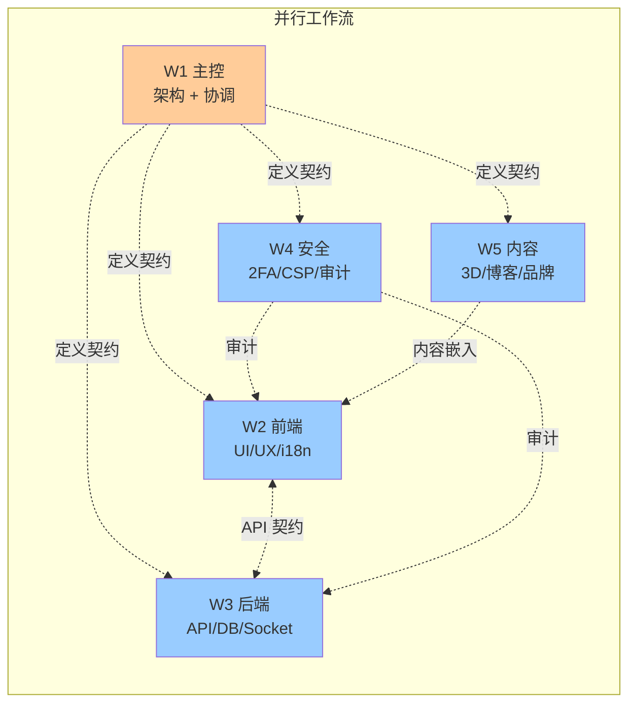

# 工作流定义（Workstreams）

> 5 条并行工作流，每条独立推进，每天合流到 main。
> 这是"多窗口并行开发"的指挥中心。

---

## 总览



---

## W1：主控（Architect / Coordinator）

**定位**：架构师 + 协调员 + 守门员。所有跨流冲突在这里仲裁。

### 责任范围

- 架构图维护（`docs/ARCHITECTURE-VISUAL.md`）
- ADR 记录（`docs/DECISIONS.md`）
- 战略文档（`docs/STRATEGY.md`）
- 任务拆解 + 优先级排序
- 每日检查 4 条流的进展，处理冲突
- Code Review（最终关卡）
- 合并到 main 的最终决定权

### 工作目录

- 主仓库：`critical/`
- 分支前缀：`chore/arch-*`、`docs/*`

### 不做什么

- 不写业务代码（除非紧急救火）
- 不深入某条流（保持全局视野）

### 当前任务

- ✅ 文档与协作框架建立（W1）
- ⏳ 月 1 周 1 完成 → 启动 W2-W5 第一轮任务

---

## W2：前端（Frontend）

**定位**：UI / UX / 动效 / i18n / SEO 一切前端体验。

### 责任范围

- `frontend/` 目录全部
- 组件 / 路由 / 中间件
- 设计 token / Tailwind / CSS
- 动画 / 3D（与 W5 协作）
- E2E 测试
- 国际化（messages/\*.json）

### 工作目录

- worktree：`../critical-fe/`（独立 node_modules）
- 分支前缀：`feat/fe-*`、`fix/fe-*`、`refactor/fe-*`

### 当前积压（按优先级）

1. **Light theme 视觉验证**（剩余组件层语义 token 改造）
2. **3D 产品展示**（与 W5 共建，月 2 W5）
3. **更深入的 SEO**（structured data 扩展）
4. **微交互优化**（hover、loading、empty state）
5. **图像懒加载 + LQIP**（性能）
6. **Storybook 接入**（设计系统站）

### 输入依赖

- `shared/` 的 Zod schema（接口契约不变就独立）
- `messages/*.json`（W5 协助内容）

### 输出

- `pnpm --filter frontend build` 不能挂
- `pnpm --filter frontend test:e2e` 不能挂
- Lighthouse mobile ≥ 85

---

## W3：后端（Backend）

**定位**：API / 数据库 / 实时 / 定时任务 / 邮件 / 支付 一切服务端逻辑。

### 责任范围

- `backend/` 目录全部
- API 路由 / 中间件 / 服务层
- Mongoose 模型与 migration
- Socket.io 实时
- 定时任务 / 队列
- 邮件 / Webhook / 第三方集成

### 工作目录

- worktree：`../critical-be/`
- 分支前缀：`feat/be-*`、`fix/be-*`、`refactor/be-*`

### 当前积压（按优先级）

1. **幂等性键**（PayPal capture / refund）
2. **库存分布式锁**（多实例时防超卖）
3. **API 版本化**（重构到 `/api/v1/*`）
4. **OpenAPI 自动生成**（zod-to-openapi）
5. **PII 加密**（Mongoose 字段级加密）
6. **审计日志保留策略 + GDPR 导出 API**
7. **Webhook 重试 / 死信队列**
8. **Sentry Performance APM 集成**

### 输入依赖

- `shared/` 的 Zod schema（接口契约）

### 输出

- `pnpm --filter backend test:coverage` 通过门槛
- 所有路由有 OpenAPI 描述
- 所有写操作有 AuditLog

---

## W4：安全（Security）

**定位**：跨切关注点。审计 W2 + W3 的所有变更，主动加固。

### 责任范围

- 跨整个仓库（不限于某目录）
- 关注点：认证 / 授权 / 加密 / 验证 / 审计 / 合规
- 工具链：CodeQL / Semgrep / Trivy / Snyk
- 渗透测试 / OWASP ZAP
- 安全 ADR

### 工作目录

- worktree：`../critical-sec/`
- 分支前缀：`feat/sec-*`、`fix/sec-*`、`chore/sec-*`

### 当前积压（按优先级）

1. **Admin 2FA**（TOTP，月 1 W2 必做）
2. **CSP 移除 unsafe-inline**（用 nonce）
3. **PII 加密**（与 W3 协作）
4. **Semgrep 集成 + 规则集**
5. **SBOM 生成**（Syft + GitHub Action）
6. **OWASP ZAP 自动扫描**（CI 跑 baseline）
7. **Cookie SameSite=Strict 全审计**
8. **bug bounty 政策起草**

### 输入依赖

- 几乎不依赖（独立审计）
- 修代码时需协调 W2 / W3

### 输出

- `docs/SECURITY-AUDIT.md` 持续更新
- 每个 Phase 末出"安全态势报告"
- CI 上 ZAP / Semgrep 全绿

---

## W5：内容 + 3D（Content + Visual）

**定位**：让产品看起来像 Apple 官网，让文案像 Stripe。

### 责任范围

- 3D 模型 / WebGL / R3F
- 文案（落地页 / 邮件 / 错误信息）
- 博客内容
- FAQ / 文档
- 品牌指南
- 视频脚本

### 工作目录

- worktree：`../critical-content/`
- 分支前缀：`feat/content-*`、`docs/content-*`

### 当前积压（按优先级）

1. **3D 产品展示**（R3F + 占位模型，月 2 W5）
2. **FAQ 深度扩展**（30+ 条）
3. **Press kit**（PDF + zip 下载）
4. **品牌指南**（颜色 / 字体 / Tone）
5. **视频脚本库**（10 个产品视频脚本）
6. **博客模板**（MDX + content-collections）
7. **Mintlify 文档站**

### 输入依赖

- W2（组件挂载点）
- 你（品牌素材：logo / 视频 / 配色偏好）

### 输出

- `docs/BRAND-GUIDE.md`
- `frontend/public/press-kit.zip`
- `frontend/src/components/3d/*`
- `frontend/content/blog/*.mdx`
- `frontend/content/faq.json`

---

## 跨流协作规则

### Rule 1：单一真相源

- 接口契约住在 `shared/`
- 颜色 / 字体住在 `tailwind.config.ts`
- i18n 住在 `messages/*.json`
- **任何"这个值定义在哪？"应该有唯一答案**

### Rule 2：变更通告

任何会影响其他流的改动，必须先在 `docs/INTERFACES.md` 走 mini RFC：

1. PR 标题 `RFC: <change>`
2. 提案 1-2 段说明
3. 影响哪些流（@mention）
4. 24h 异议期
5. 无异议自动合并；有异议在 W1 仲裁

**典型场景**：

- W3 想改 Lead schema → 必须 RFC（影响 W2）
- W2 想加新页面用 W3 不存在的 API → 必须 RFC
- W4 想加 CSP → 必须 RFC（影响 W2 内联 style / script）

### Rule 3：合流仪式

每天结束前：

```bash
# 在每个 worktree 跑
git push origin <branch>

# W1 在主控窗口
git fetch --all --prune
git log --all --oneline -30   # 看全局
```

W1 决定合并顺序，按以下原则：

1. 先合 W4（安全）— 安全永远优先
2. 再合 W3（后端契约稳定）
3. 然后 W2 / W5（基于稳定后端）
4. 冲突时谁的代码影响小谁先合

### Rule 4：CI 守门

任何流的分支推上去 CI 必须全绿：

- typecheck
- lint
- test:coverage
- build
- check-i18n

不绿不准合 main。

### Rule 5：PR 模板

每个 PR 标题用前缀：

- `[W1]` 主控
- `[W2]` 前端
- `[W3]` 后端
- `[W4]` 安全
- `[W5]` 内容

PR 描述必须包含：

- 改了什么
- 为什么改
- 影响哪些其他流（@mention）
- 测试方法
- Checklist：测试通过、文档更新、ADR（如适用）

---

## 当前状态快照

| 流  | 当前任务            | 分支              | 状态        | 阻塞                 |
| --- | ------------------- | ----------------- | ----------- | -------------------- |
| W1  | 文档框架 + 多窗口基建 | main              | ✅ 完成      | -                    |
| W2  | 待启动              | feat/fe-base      | 基建就绪    | 月 1 W2 启动        |
| W3  | 待启动              | feat/be-base      | 基建就绪    | 月 1 W2 启动        |
| W4  | 待启动（首选）      | feat/sec-base     | 基建就绪    | 月 1 W2 启动        |
| W5  | 待启动              | feat/content-base | 基建就绪    | 等品牌素材确认       |

---

## 启动多窗口的具体做法

### Step 1：用 git worktree 创建并行目录

见 `docs/PARALLEL-DEV-GUIDE.md`。

### Step 2：开 N 个 Kiro 窗口

每个窗口打开对应 worktree 目录。

### Step 3：给每个窗口贴 prompt

```
你是 Window W3 后端工作流。
工作目录：critical-be/
当前任务：[具体任务]
契约文档：docs/INTERFACES.md
不要碰：frontend/、其他流的目录
完成标准：[可验证]
```

每个窗口在自己的目录里 commit，push 到 `feat/be-xxx`。

### Step 4：W1 主窗口每日 review

- 拉所有分支
- 跑 CI
- 决定合并顺序
- 解决冲突

---

## 节奏建议

### 当前阶段（Phase 0 月 1 W1）

**只开 1 个窗口（W1 主控）**。先把所有规划文档落地，给后续提供基础。

### 月 1 W2 起

**开 3 个窗口**：W1 + W3 + W4。

- W1 协调 + Code Review
- W3 重构后端基础（API 版本 / 幂等性 / 锁）
- W4 同步加固安全

### 月 2 起

**开 5 个窗口**全开。

### 月 3

**收敛到 2 个窗口**：W1 + 集成测试。所有特性冻结，专注上线准备。

---

## 度量指标

每周 W1 在 `docs/weeks/W{N}-REPORT.md` 记录：

| 指标           | 目标     | 实际 |
| -------------- | -------- | ---- |
| 各流 commit 数 | 均匀分布 |      |
| 跨流冲突数     | < 2 / 周 |      |
| RFC 数 / 通过  |          |      |
| CI 失败率      | < 5%     |      |
| 阻塞天数       | < 2 / 流 |      |

---

> "Many hands make light work."
> 但前提是这些手知道彼此在干什么。这个文档就是让它们知道。
